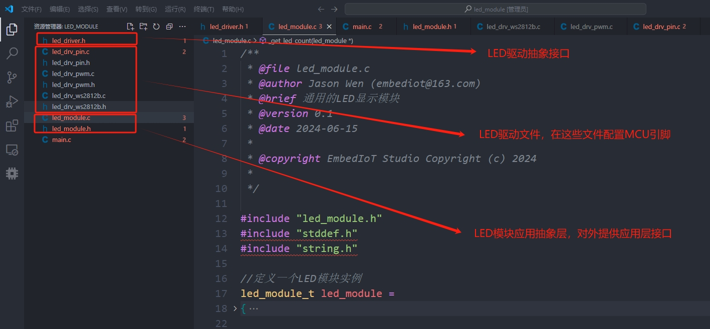
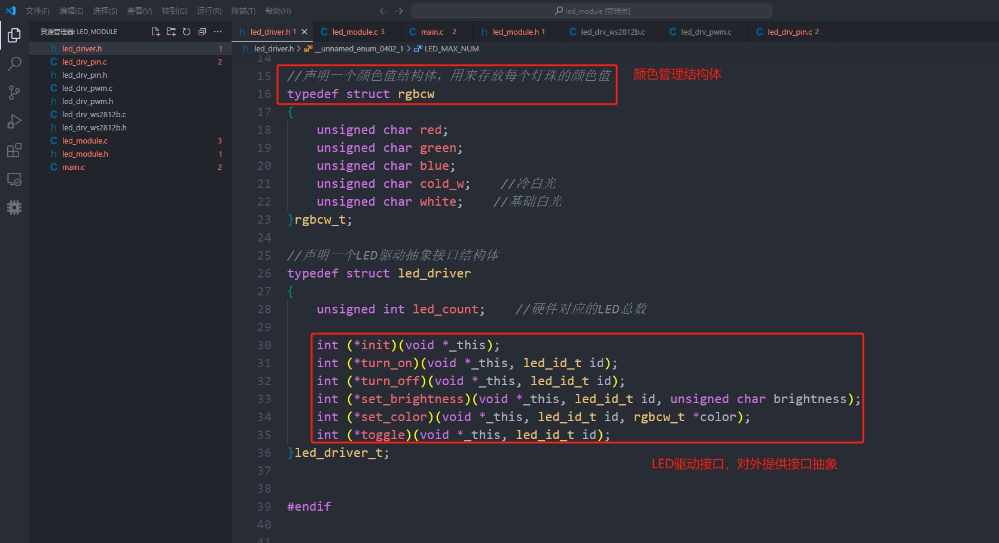
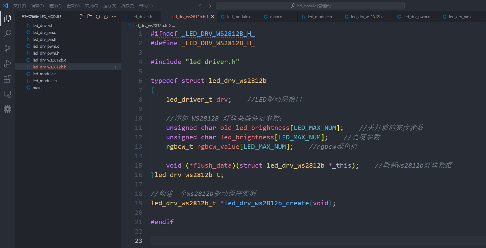
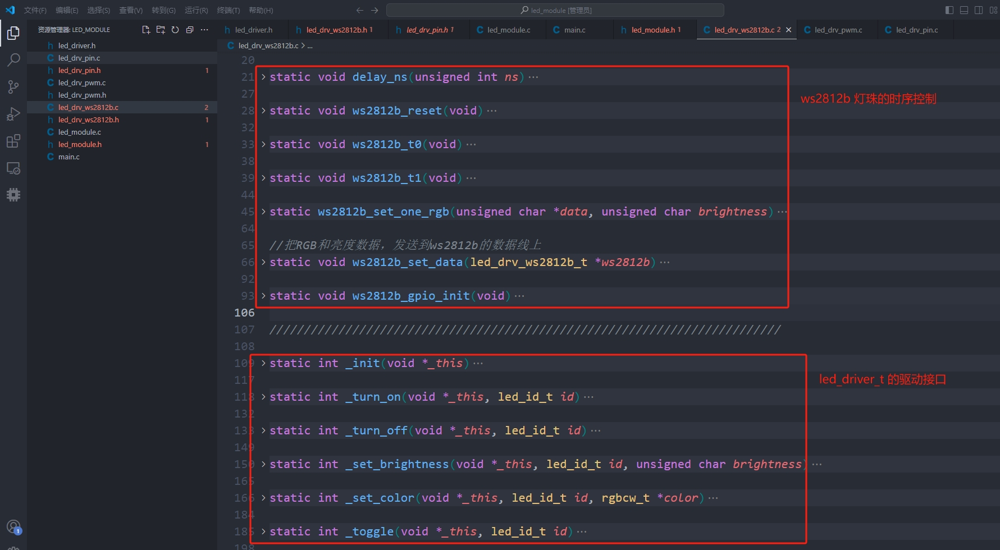
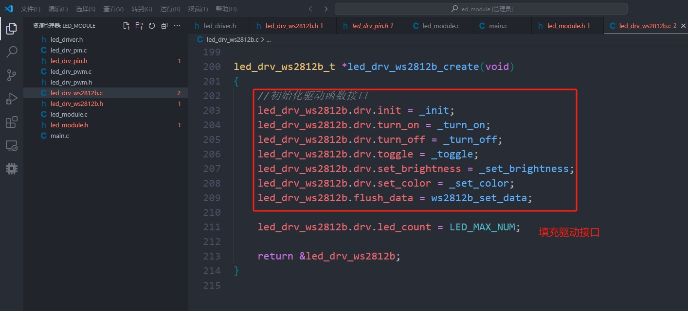
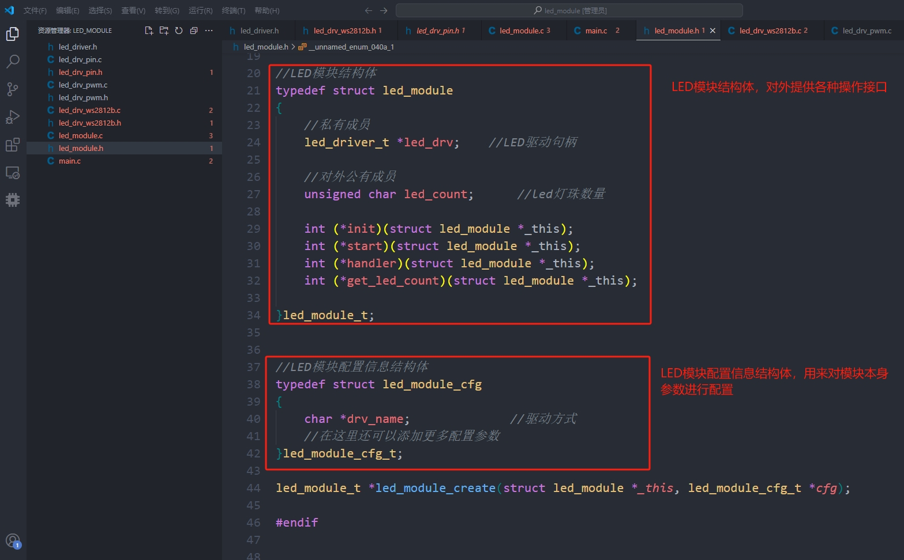
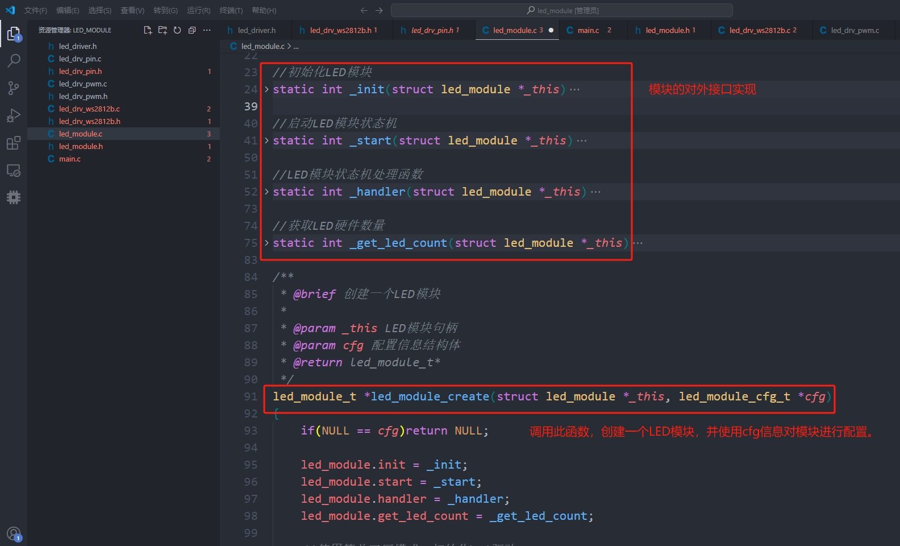
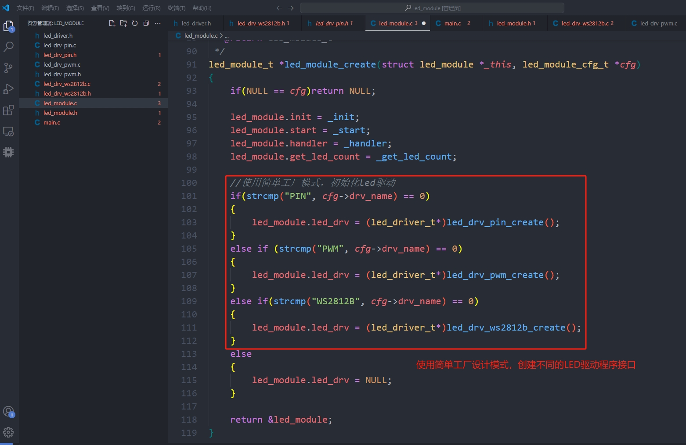
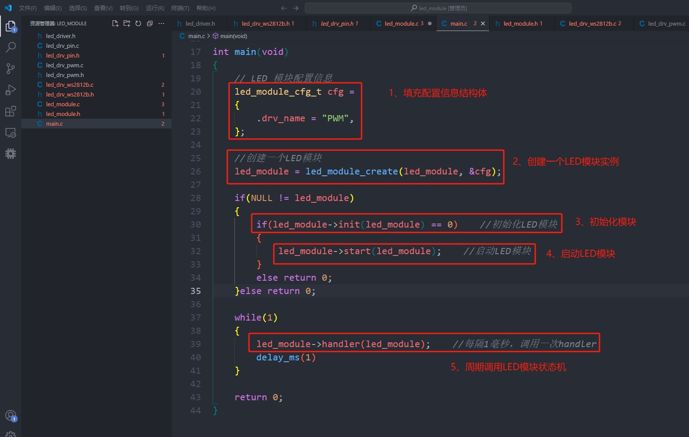

# led_module

#### 介绍
通用的单片机LED显示模块，基于嵌入式 C 语言面向对象，采用简单工厂设计模式

#### 设计教程

发光二极管（LED），是科学物理世界最重要的发明之一，三原色RGB-LED灯有一段经典的发展历史，具体可以在网络上搜索相关资料进行了解，特别是得益于蓝色 LED 灯的发明创造，才能有今天如此缤纷幻彩的世界。

点亮一颗LED灯，可以说是每一位嵌入式初学者入门必学的首要内容，点亮一颗LED之所以成为入门经典，是因为点灯这个过程，可以让每一位初学者对嵌入式开发的软件环境搭建，开发板硬件基础，固件编译和烧录，等等环节，有一个概念性的认识。

如果在物理电路的角度进行分析，就是让这颗LED灯珠的阳极和阴极有一定的电压差，LED灯就会被点亮，而对于MCU芯片来说，就是某个驱动引脚对外输出高低电平，让这颗LED灯点亮或者熄灭。

大道至简，简单的高低电平翻转就可以让一颗LED灯不断亮灭交替，N 颗不同颜色的LED灯进行排列组合，再配合产品经理给它们赋予的色彩意义，一个缤纷的幻彩世界就这样出现在我们的面前。

嵌入式软件入门学习点灯，一般都是告诉我们如何把灯点亮，然而，在复杂的产品逻辑背后，多种颜色的LED灯配合不同的亮灭周期，会为产品带来不同的功能含义，这已经不是简单的高低电平所能够处理的了。

上一篇文章，我们基于面向对象和状态机的思想，设计了一个通用的单片机按键检测模块，关于上一篇文章的内容，可以点击这里。

本篇文章，我们基于面向对象的设计思想，配合简单工厂设计模式，编写一个单片机通用的LED显示模块，模块尽可能遵循“设备”与“驱动”分离原则，模块内部做到高内聚，并且面向接口编程，为应用层提供统一的调用接口。

以下是模块的具体设计过程。

1、通用的单片机LED显示模块，主要是把LED引脚相关的驱动接口抽象出来，因为不同的LED效果，会有不同的驱动方式，比如MCU引脚电平翻转驱动，PWM驱动，LED芯片驱动，等等，整个模块的源码文件，如下图所示。

2、先看一下led_driver.h文件，在这里文件里面，主要是声明了一个枚举变量，有多少个物理LED灯就有多少个编号，这个编号是操作驱动层的索引值，因此LED_MAX_NUM通常表示物理LED灯珠的总数。同时还声明了一个颜色值结构体以及一些LED驱动接口，如下图所示。

3、不同的LED显示功能，需要对接不同的LED驱动程序，比如，如果只需要简单的LED亮灭翻转，可以只采用简单的引脚驱动，如果需要进行调光或者色彩控制，则可以选择使用PWM调光，或者使用自带LED驱动芯片的灯珠，如WS2812B。

4、对于不同的LED驱动程序（led_drv_pin/ led_drv_pwm/ led_drv_ws2812b），都包含了led_driver的抽象接口，我们以led_drv_ws2812b为例，来描述一下这个架构，其他两个驱动程序同样也可以作为参考。

5、在led_drv_ws2812b.h文件里面，声明了一个led_drv_ws2812b_t结构体里面，这个结构体主要是包含了led_driver_t驱动接口，同时也包含了ws2812b灯珠的某些特定参数，比如亮度参数，颜色值参数，以及对外提供一些必要的操作接口，等等，具体代码如下图所示。

6、在led_drv_ws2812b.c文件里面，主要是对led_driver_t接口的实现，包括MCU驱动引脚的初始化配置，以及ws2812b的时序控制，然后根据这些接口，分别填充led_driver_t结构体里面的各个成员接口，代码如下图所示。

7、在源文件的led_drv_ws2812b_create里面，主要是用上面的函数，填充led_drv_ws2812b结构体对象，记住这个对象，很重要，会被外部的led_module进行调用，具体实现代码如下图所示。

8、完成了LED驱动程序设计后，再来考虑一下LED模块的设计，在led_module.h文件里面，声明一个LED模块结构体，struct LED_MODULE，在这个结构体里面，定义了一个led_drv驱动程序接口，并且对外提供了模块初始化接口，模块启动接口，模块状态机处理接口，等等。同时还提供了一个配置信息结构体，struct LED_MODULE_CFG，主要用来对led_module进行参数配置的，具体代码实现如下图所示。

9、在led_module.c文件里面，init_()函数主要是初始化模块的驱动程序接口，start_()函数主要是用来启动状态机，handler_()函数主要是用来进行状态机管理（待完善），然后使用led_module_create()函数，创建一个LED模块实例，具体代码如下图所示。

10、对于led_module_create() 函数主要是对外部接口进行赋值初始化，并且使用简单工厂设计模式，根据应用层不同的配置（通过cfg配置信息判断），从而选择不同的驱动程序，对于应用层来说，其LED驱动接口都是一致的（面向接口编程），这样就可以完全做到“设备”与“驱动”分离，提高程序模块化的内聚程度。

11、在应用层main.c文件，调用led_module的时候，一般先定义一个led_module_cfg配置信息结构体，然后调用led_module_create函数创建一个led模块实例，然后调用init()函数接口对模块进行初始化，随后调用start接口启动模块，最后调用handler()接口，周期调用LED模块的状态机进行处理，代码如下图所示。

12、美中不足的是，目前这个LED显示模块的状态机还在完善当中，现在只是简单地在状态机处理函数_handler()里面翻转LED灯，用来验证驱动接口的可行性，感兴趣的小伙伴可以下载模块源码，对状态机进行完善，或者持续关注该模块的源码仓库。
